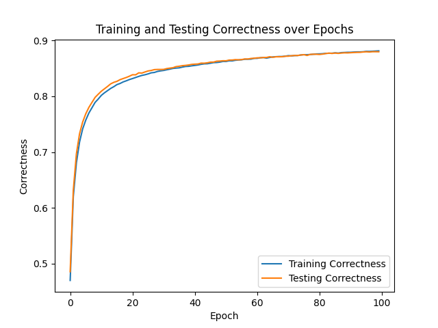
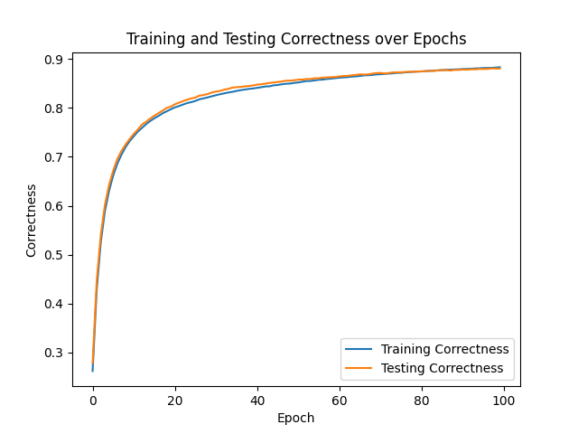

### MNIST classification problem

#### Project Overview

This project tackles the classic MNIST digit classification problem by implementing classifiers from scratch. We explore both a simple one-layer perceptron model and a more complex two-layer model to understand the fundamentals of neural network operations and performance differences. Additionally, we employ a custom-built seam carving algorithm for image processing to optimize our dataset before feeding it into our models.

#### Features

- **One-Layer Perceptron Model**: A straightforward implementation that serves as a baseline for image classification tasks.
- **Two-Layer Model**: A more sophisticated approach with an additional layer to capture more complex patterns and improve classification accuracy.
- **Seam Carving for Image Preprocessing**: A technique implemented from scratch to resize images non-uniformly, preserving the content of interest while maintaining the overall structure of digits.

#### One Layer NN

#### Two Layer NN

#### Seam Carving

